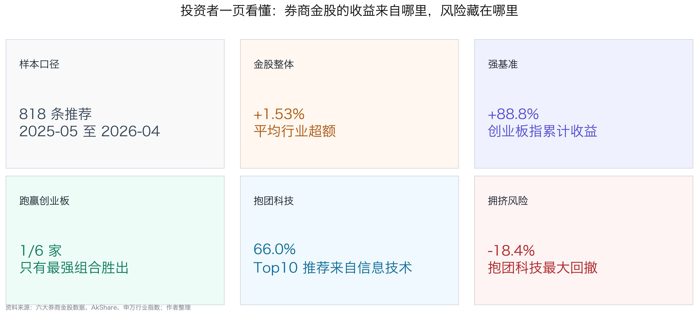
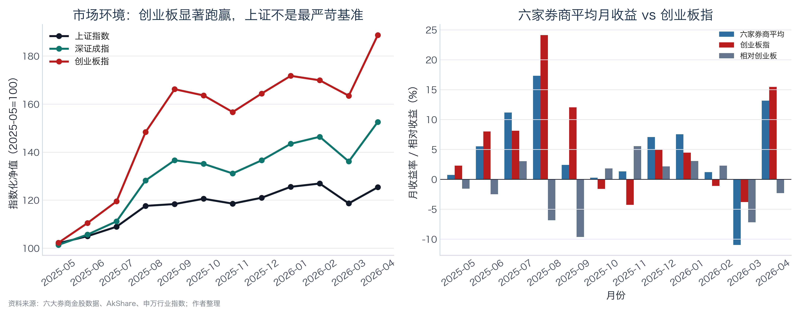
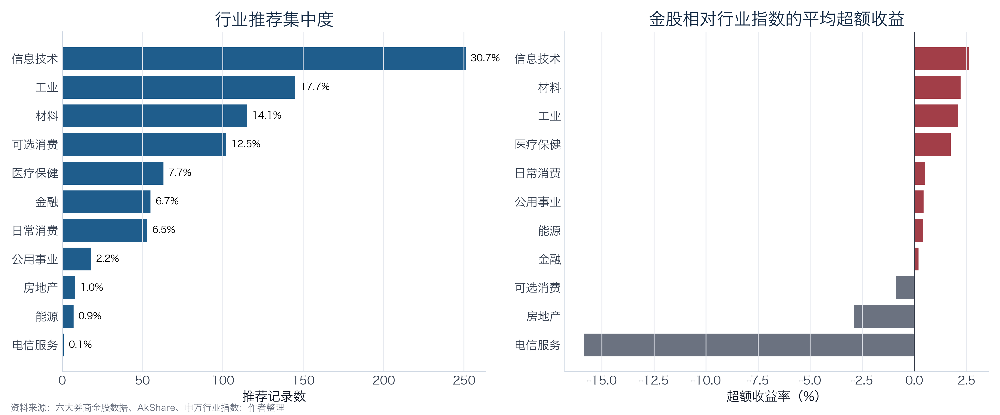
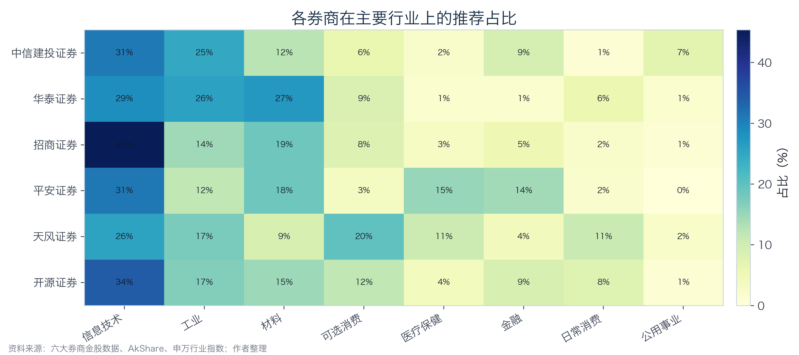
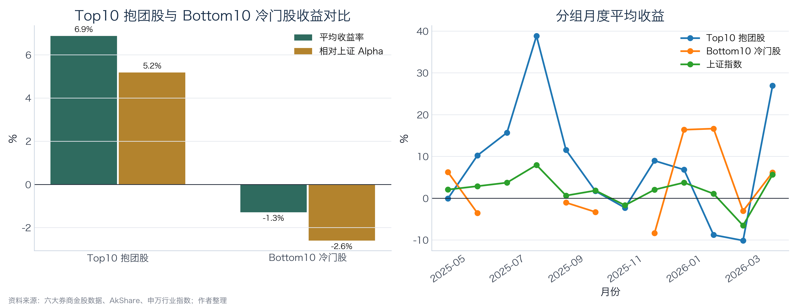
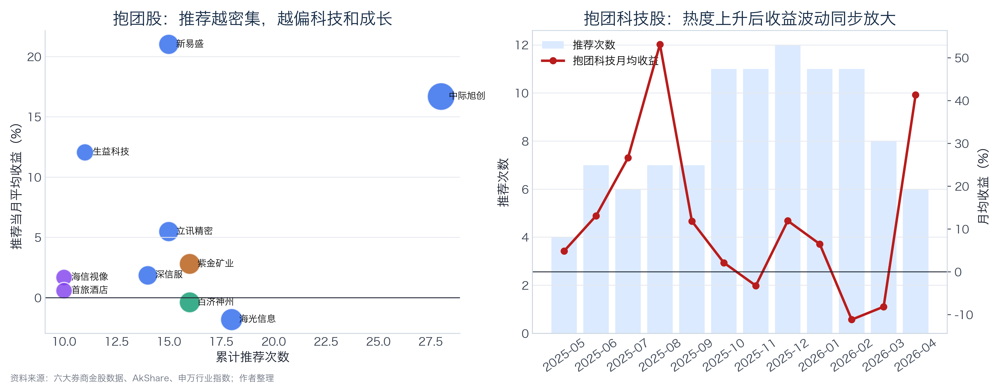
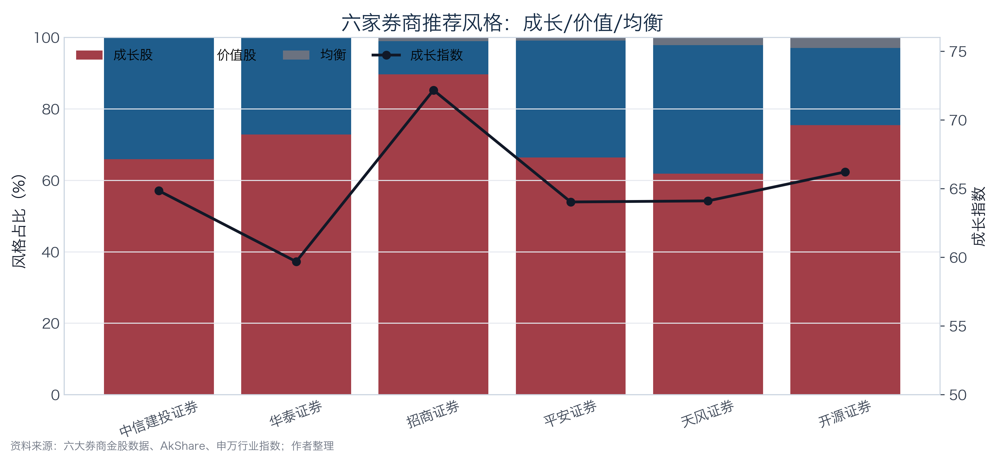
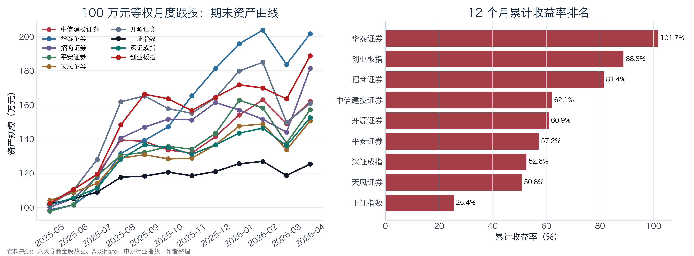
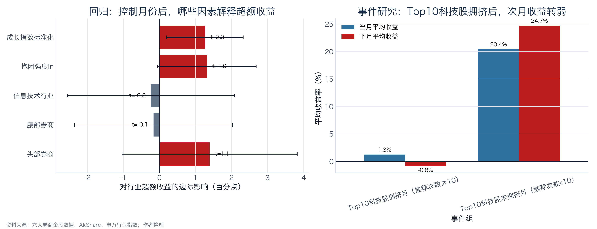

# 券商金股是“指路明灯”还是“韭菜指南”？

**面向投资者的金股跟投研究报告**  
**区间：2025 年 5 月至 2026 年 4 月**

## 研究框架

本报告围绕券商月度金股推荐的投资价值这一核心问题，按照"决策主体界定→制度与市场背景→数据与方法→多维度实证→结论与局限"的逻辑链条展开分析，具体结构如下：

| 研究模块 | 对应章节 | 研究内容 |
| --- | --- | --- |
| 决策主体与研究目标 | 第1节 | 研究服务对象为普通个人投资者，明确三个核心研究问题：金股可跟投性、头部券商优势的稳健性、高频推荐标的的拥挤风险 |
| 制度与市场背景 | 第2-3节 | 梳理资本市场新"国九条"、券商分类评价制度修订等政策，刻画研究区间内科技成长结构性行情特征，确立创业板指作为强基准的分析逻辑 |
| 数据来源与处理 | 第4节 | 说明数据来源、样本清洗口径、组合收益计算方式、行业映射方法、风格指标构造及回测理想化假设 |
| 多维度实证分析 | 第5-8节 | 从行业配置偏好、推荐集中度、成长/价值风格特征、组合回测收益四个维度展开统计分析，并以多重基准进行对比检验 |
| 初步结论 | 第9节 | 基于实证结果回答金股有效性、主要影响群体及待进一步验证的问题 |
| 进一步分析 | 第10节 | 回归分解行业超额收益来源，通过事件研究框架考察高频推荐后的次月收益衰减特征 |
| 局限性与风险提示 | 第13节 | 说明样本周期、行业映射、因果推断、回测假设及风格指标等方面的研究局限 |

## 研究要点



1. **金股推荐包含一定信息价值，但不宜作为无条件跟投依据。** 六家券商金股12个月平均行业超额收益率为+1.53%，表明推荐具备一定的选股信息含量；但回归分析显示，该超额收益的核心驱动力为成长风格暴露（成长指数t=2.31，5%水平显著），而非独立于市场风格的选股Alpha，其有效性对市场环境具有较强依赖性。

2. **基准选择对业绩评价具有决定性影响。** 上证指数同期累计+25.41%，创业板指累计+88.76%。以上证指数为基准，六家券商组合全部实现正超额；以创业板指为基准，仅华泰证券1家跑赢（累计+101.70%）。基准差异导致同一组数据可得出截然不同的绩效评价。

3. **头部券商在描述统计中相对领先，但该优势在控制风格后不具统计显著性。** 头部组平均行业超额收益+2.19%，高于腰部（+1.54%）和尾部（+1.28%）；但OLS回归中头部虚拟变量系数不显著（t=1.12），且腰部组招商证券以+5.30%的平均月度收益位列第二，表明梯队差异并不稳健。

4. **推荐集中度显著，科技类标的为主要聚集方向。** Top10高频推荐标的合计占全部推荐记录的18.7%，其中信息技术类标的占Top10推荐次数的66.0%。高频推荐既可能反映机构研究共识的趋同，也可能伴随交易方向同质化带来的拥挤风险。

5. **最大风险敞口在于风格暴露的三重集中。** 行业维度前三大行业集中度62.5%，标的维度Top10占比18.7%，风格维度六家券商成长股推荐占比均超60%。三重集中意味着一旦科技成长行情转弱，跨券商的分散配置无法有效对冲系统性回撤。2026年3月的市场调整中，六家券商平均收益-10.94%、显著弱于创业板指的-3.79%，即为该风险的直接体现。

## 1. 决策主体和研究目标

本报告面向普通个人投资者，研究目标聚焦3个核心问题：

- 券商月度金股组合是否具备可跟投的超额收益？
- 头部券商的选股能力是否系统性优于中小券商？
- 多家券商集中推荐的科技热门股，其收益来源究竟是个股Alpha还是行业Beta？

围绕上述问题，本报告从行业配置偏好、推荐集中度、成长/价值风格特征、组合实际收益四个维度展开实证分析，力图为投资者提供一套可量化、可验证的金股跟投决策参考框架。

## 2. 券商分组依据与分层逻辑

业内有一个很常见的直觉：券商排名越靠前，研究资源越多，机构客户越强，研究能力也应当越强。这个“排名”通常不是单一榜单，而是由三类信息共同构成：

- **监管评价。** 证监会依据《证券公司分类监管规定》对券商实施分类评价，评价内容涵盖风险管理能力、持续合规状况及业务发展状况。需指出，该分类结果的制度定位是服务审慎监管，并非信用评级或业务能力的直接排名。
- **经营规模。** 总资产、净资本、营业收入、净利润等财务指标从资源禀赋角度反映券商在研究、投行、机构服务等领域的投入能力上限。
- **市场影响。** 研究覆盖面、机构客户触达能力、财富管理渠道规模及品牌认知度，共同决定了金股推荐在市场中的传播广度与关注程度。

基于上述逻辑，本报告沿用课题组的样本设计方案，将六家券商划分为三个研究梯队。需特别说明：此处头部、腰部、尾部系研究分组概念，旨在构造可检验的对照结构，不构成对相关券商资信等级或经营能力的评价。

其核心假设为：若研究资源禀赋与荐股能力正相关，则头部组应在行业超额收益、组合绝对收益及回撤控制等指标上系统性优于其他梯队。

| 研究分组 | 样本券商 | 分组逻辑 | 参考依据 |
| --- | --- | --- | --- |
| 头部 | 中信建投证券、华泰证券 | 综合实力与研究资源处于行业前列，作为检验强研究能力假设的核心样本 | 证监会2020年公开分类结果均为AA级；2024年度财务数据显示两家在总资产、净利润等指标上位居行业前列 |
| 腰部 | 招商证券、平安证券 | 大中型综合券商代表，作为中间对照组，用以观察非顶尖研究资源条件下的荐股表现 | 证监会2020年分类结果同为AA级，但在研究所规模、新财富上榜分析师数量等维度上与头部组存在梯度差异，本报告据此将其列入中间梯队 |
| 尾部 | 天风证券、开源证券 | 中小型或特色化券商代表，用以观察资源约束下差异化策略的收益特征 | 证监会2020年分类结果中天风证券为A级、开源证券为BB级，在监管评价与经营规模上与前两组形成明确梯度 |

上述分组设计使结论具备双向可证伪性：若头部组显著跑赢，则资源禀赋假说得到数据支持；若中小券商表现相当甚至更优，则说明金股收益更多取决于市场风格暴露与个股选择能力，而非单纯由券商规模决定。

## 3. 政策、行业与市场背景

### 3.1 政策背景：资本市场高质量发展框架下的券商研究审视

2024年4月，国务院印发《关于加强监管防范风险推动资本市场高质量发展的若干意见》（即资本市场新"国九条"），明确将"加强监管、防范风险、推动高质量发展"确立为资本市场制度建设的核心主线。该文件从上市公司质量、中介机构勤勉尽责、投资者权益保护等层面提出了系统性要求，为评估券商公开荐股行为的实际投资价值提供了政策依据。

与此同时，证券公司分类评价制度持续深化。证监会发布的关于修改《证券公司分类监管规定》的决定自2025年8月22日起施行，制度名称正式调整为《证券公司分类评价规定》，进一步强化了对券商合规能力、风险管理水平及专业服务质量的综合考量。这一制度演进表明，券商研究业务并非孤立存在，而是嵌套在整体合规治理与业务能力评价体系之中。

| 核心文件 | 发布时间/节点 | 关键条款 | 与本研究的关联 |
| --- | --- | --- | --- |
| 国务院：资本市场新"国九条" | 2024-04-12 | 加强监管、防范风险、推动资本市场高质量发展 | 强化中介机构责任与投资者保护，为检验金股推荐的实际投资价值提供政策语境 |
| 证监会：修改《证券公司分类监管规定》的决定 | 2025-08-22起施行 | 调整为《证券公司分类评价规定》 | 券商分类评价涵盖合规、风控与业务发展，为本报告的券商分层研究设计提供制度参照 |
| 证监会：2020年证券公司分类结果 | 2020-08-26 | 分类结果不构成对券商资信状况及等级的评价 | 本报告仅将公开分类结果作为研究分组的辅助参考，不作为投资评级依据 |

综上，本报告的政策定位并非评价特定券商的经营优劣，而是在投资者保护与市场高质量发展的制度框架下，实证检验券商公开荐股是否能够形成可量化、可验证的投资价值。在监管持续强调中介机构责任的背景下，厘清金股收益的真实来源具有现实意义。

### 3.2 行业背景：卖方研究的价值争议与金股的检验窗口

卖方研究长期面临两方面评价。肯定方认为，券商研究能够将产业趋势、盈利预测与估值逻辑进行系统化整合，有效降低投资者的信息搜集成本；质疑方则指出，卖方研究天然服务于交易佣金与机构客户关系维护，研报存在系统性乐观倾向，金股推荐容易演变为热门赛道的集中展示。

相较于一般研报，月度金股名单为检验上述争议提供了更为理想的研究样本。原因在于：研报的分析观点具有较大的弹性空间，而金股名单最终需要落实到具体标的与可衡量的收益表现上。对投资者而言，核心关切在于推荐标的是否产生了正向收益，以及该收益究竟源自个股层面的选股Alpha，还是仅为市场风格Beta的被动暴露。

### 3.3 市场背景：研究区间处于典型的科技成长结构性行情

| 指数 | 累计收益率 | 月均收益率 | 月度波动率 | 最大回撤 | 在本报告中的角色 |
| --- | --- | --- | --- | --- | --- |
| 创业板指 | +88.76% | +5.74% | 8.46% | -5.73% | 科技成长强基准 |
| 深证成指 | +52.60% | +3.75% | 6.09% | -7.02% | 宽基参照 |
| 上证指数 | +25.41% | +1.96% | 3.62% | -6.51% | 宽基参照 |



2025年5月至2026年4月的12个月研究区间内，A股市场呈现显著的科技成长结构性行情特征。创业板指累计上涨88.76%，大幅领先于上证指数同期25.41%的涨幅。若仅以上证指数作为业绩比较基准，六家券商金股组合的表现均较为亮眼；然而在科技成长主导的行情结构下，创业板指显然构成更为贴近金股风格暴露的参照基准，能够更有效地区分券商荐股中的主动选股贡献与被动风格收益。

从初步统计数据来看，六家券商推荐记录中前三大行业集中度达62.5%，推荐次数排名前10的抱团标的占全部推荐记录的18.7%，各券商成长股推荐占比均超过60%，而最终仅有1家券商组合的累计收益跑赢创业板指。上述数据揭示出一个需要审慎对待的问题：若不对行业暴露、风格特征与基准选取进行拆解分析，投资者容易将科技成长行情带来的市场Beta收益误判为券商主动选股能力所贡献的Alpha收益。

### 4. 数据来源与处理

### 4.1 数据来源

本报告的金股推荐数据来源于Wind金融终端，涵盖六家样本券商2025年4月至2026年4月期间公开发布的月度金股推荐记录。风格指标数据（PE、营收增长率、股利收益率等）、市场基准数据（上证指数、深证成指、创业板指的日收盘价等）通过AkShare接口获取，按月末收盘价计算月度收益率；行业基准采用申万一级行业指数月度收益率，并通过Wind行业分类（GICS体系）与申万行业分类的对应关系进行映射匹配。需指出，GICS与申万两套行业分类体系并非一一对应，部分行业存在口径差异（如GICS"工业"与申万"机械设备""电力设备"等存在交叉），本报告采用简单平均方式处理多对一映射情形。该处理可能对个别行业的超额收益计算引入一定偏差，但不影响整体方向性结论。

### 4.2 关键处理口径

- **时间口径：** 原始数据覆盖2025年4月至2026年4月共889条记录。考虑到2025年4月数据仅含71条且不完整，本报告予以剔除，最终保留2025年5月至2026年4月共818条推荐记录，严格对应12个完整自然月。
- **推荐口径：** 以单条推荐记录为统计单位。同一标的被多家券商或跨月重复推荐时，每次均独立计入。该口径与投资者每月实际面对的金股名单形式一致。
- **收益口径：** 假设投资者于每月初按当月金股名单等权建仓，月末按区间涨跌幅结算。组合回测采用月度滚动复利模式，即每月将期末资产重新等权分配至下月金股组合。
- **风格口径：** 沿用课题组构造的综合成长指数，该指数整合PE倍数、营收增长率及低分红特征三个维度，数值越高表明标的成长属性越强。
- **现实偏差说明：** 回测收益为理想化计算结果，未扣除交易佣金、印花税、冲击成本、滑点及停牌等因素，亦未考虑实际建仓时点与名单公布日之间的时滞。真实跟投收益预计将系统性低于本报告回测结果。

### 4.3 核心分析指标体系

| 构造指标 | 计算方式 | 分析目的 |
| --- | --- | --- |
| 行业集中度 | CR1/CR3/CR5（前N大行业推荐占比） | 衡量推荐是否集中于少数行业，识别赛道偏好特征 |
| 行业超额收益 | 个股当月收益率 - 对应申万一级行业指数月收益率 | 剥离行业Beta后，检验券商在行业内部的选股Alpha |
| 推荐集中度 | 单只标的12个月累计被推荐次数、Top10标的推荐占比 | 衡量机构间推荐重合程度及潜在交易拥挤风险 |
| 风格指标 | 综合成长指数、成长/价值股占比、PE/营收增速/股利收益率 | 判断券商荐股的风格暴露方向与程度 |
| 组合累计收益 | 100万元本金按月等权滚动复利 | 模拟投资者实际跟投的资产增值路径 |
| 强基准相对收益 | 组合累计收益率 - 创业板指累计收益率 | 在科技成长行情中检验金股组合是否具备相对可替代基准的超额贡献 |

上述指标体系构成了后续分析的框架：行业集中度揭示配置特征，行业超额收益分离选股能力，推荐集中度识别拥挤风险，风格指标刻画Beta暴露方向，组合收益度量实际投资结果，强基准相对收益则最终回答金股跟投策略是否优于被动配置可比风格指数。

### 4.4 政策处理说明

本报告涉及的核心监管文件中，2024年新"国九条"发布于研究区间之前，2025年《证券公司分类评价规定》施行日（2025年8月22日）虽落在样本区间内，但该制度修订主要涉及评价体系名称与框架调整，并非针对券商研究业务的直接干预性政策冲击，不具备事件研究所需的外生性条件。因此，本报告不采用政策前后对照的事件研究设计，而是将政策背景作为研究意义的制度语境，以创业板指作为风格匹配的强基准来检验市场环境对金股收益的解释力。

## 5. 维度一：行业配置偏好与行业超额收益

### 5.1 六家券商的行业推荐分布

**表5-1 各券商金股推荐基本统计**

| 券商 | 梯队 | 推荐记录数 | 唯一标的数 | 平均当月收益率 | 平均行业超额收益率 |
| --- | --- | --- | --- | --- | --- |
| 中信建投证券 | 头部 | 97 | 67 | +4.19% | +1.34% |
| 华泰证券 | 头部 | 70 | 48 | +6.01% | +3.37% |
| 招商证券 | 腰部 | 97 | 40 | +5.30% | +1.71% |
| 平安证券 | 腰部 | 119 | 64 | +4.09% | +1.39% |
| 天风证券 | 尾部 | 333 | 132 | +3.54% | +1.22% |
| 开源证券 | 尾部 | 102 | 64 | +4.02% | +1.48% |

需指出，各券商推荐记录数存在显著差异：天风证券以333条记录占全部818条的40.7%，华泰证券仅70条。这种样本量不平衡意味着在梯队层面进行简单均值对比时，尾部组的统计特征在较大程度上受天风证券单家数据主导，读者在解读梯队差异时应考虑这一因素。

**表5-2 梯队层面汇总统计**

| 梯队 | 推荐记录数 | 唯一标的数 | 平均当月收益率 | 平均行业超额收益率 |
| --- | --- | --- | --- | --- |
| 头部 | 167 | 109 | +4.95% | +2.19% |
| 腰部 | 216 | 99 | +4.63% | +1.54% |
| 尾部 | 435 | 182 | +3.66% | +1.28% |

从梯队汇总数据来看，头部组平均当月收益率为+4.95%，行业超额收益率为+2.19%，均高于腰部（+4.63%、+1.54%）和尾部（+3.66%、+1.28%），呈现出与研究资源禀赋正相关的梯度特征。但需注意，该梯度关系在个体层面并不绝对：腰部组的招商证券以+5.30%的平均当月收益位列全部六家的第二位，表明在特定市场风格下，中间梯队券商同样可能凭借集中化的风格判断取得较优表现。

**表5-3 行业维度推荐分布与收益**

| 行业 | 推荐次数 | 推荐占比 | 金股平均收益率 | 行业指数收益率 | 平均行业超额收益率 |
| --- | --- | --- | --- | --- | --- |
| 信息技术 | 251 | 30.7% | +6.16% | +3.52% | +2.64% |
| 工业 | 145 | 17.7% | +5.72% | +3.62% | +2.10% |
| 材料 | 115 | 14.1% | +6.03% | +3.80% | +2.23% |
| 可选消费 | 102 | 12.5% | +0.24% | +1.13% | -0.89% |
| 医疗保健 | 63 | 7.7% | +2.94% | +1.19% | +1.75% |
| 金融 | 55 | 6.7% | +1.00% | +0.80% | +0.20% |
| 日常消费 | 53 | 6.5% | +0.45% | -0.08% | +0.53% |
| 公用事业 | 18 | 2.2% | +1.10% | +0.65% | +0.45% |
| 房地产 | 8 | 1.0% | +1.66% | +4.55% | -2.89% |
| 能源 | 7 | 0.9% | +3.86% | +3.42% | +0.44% |
| 电信服务 | 1 | 0.1% | -1.76% | +14.09% | -15.85% |



从行业分布来看，六家券商的推荐呈现高度集中特征。信息技术单一行业占比达30.7%，信息技术、工业、材料三大行业合计占比62.5%，前五大行业累计占比82.6%。这一分布结构表明，金股推荐并非均匀覆盖全市场，而是显著集中于科技成长与先进制造产业链。

从行业超额收益来看，信息技术（+2.64%）、材料（+2.23%）、工业（+2.10%）及医疗保健（+1.75%）四个行业录得正向超额收益，说明券商在上述行业内具备一定的选股Alpha；而可选消费（-0.89%）和房地产（-2.89%）则录得负超额收益，表明在这两个行业中金股推荐未能跑赢行业基准。

### 5.2 行业集中度的双面效应

行业高度集中在科技成长行情中具有正向贡献。研究区间内，信息技术类金股平均收益达+6.16%，剥离行业Beta后仍录得+2.64%的超额收益。工业、材料板块同样贡献了正向Alpha，三大核心行业在本轮行情中兼具行业贝塔收益与个股选股贡献。

然而，行业集中度过高也意味着隐性风险敞口的同质化。投资者若同时跟投多家券商金股，表面上实现了券商维度的分散化，但实际上可能在行业暴露层面高度重合。一旦市场风格由成长切换至红利、消费或低估值价值方向，跨券商的分散配置将无法有效对冲行业维度的系统性回撤。

**表5-4 各券商前三大行业配置**

| 券商 | 前三大偏好行业及占比 | 前三大行业合计占比 |
| --- | --- | --- |
| 中信建投证券 | 信息技术 30.9%、工业 24.7%、材料 12.4% | 68.0% |
| 华泰证券 | 信息技术 28.6%、材料 27.1%、工业 25.7% | 81.4% |
| 招商证券 | 信息技术 45.4%、材料 18.6%、工业 14.4% | 78.4% |
| 平安证券 | 信息技术 31.1%、材料 18.5%、医疗保健 15.1% | 64.7% |
| 天风证券 | 信息技术 25.5%、可选消费 19.8%、工业 17.4% | 62.8% |
| 开源证券 | 信息技术 34.3%、工业 16.7%、材料 14.7% | 65.7% |



从个体差异来看，招商证券的信息技术配置占比最高（45.4%），体现出较强的科技成长风格集中度；华泰证券在信息技术、材料、工业三个行业间分布相对均衡，行业分散程度优于其他券商；天风证券在可选消费方向上的配置占比（19.8%）明显高于其他五家，呈现出一定的差异化选择特征。上述差异为投资者评估跟投后的实际行业暴露结构提供了直接参考。

## 6. 维度二：推荐集中度与科技热门股拥挤风险

### 6.1 推荐重合度分析

12个月研究区间内，六家券商合计推荐327只不同标的。从推荐频次分布来看，仅出现1次的标的有170只，占唯一标的数的52.0%；而被2次及以上重复推荐的标的虽然数量较少，却贡献了648条推荐记录，占全部818条记录的79.2%。该分布特征表明，金股推荐存在明显的"长尾集中"结构：多数标的仅偶发性出现，少数热门标的则被高频反复推荐。

进一步聚焦推荐次数排名前10的标的（以下简称Top10），其合计推荐153次，占全部推荐记录的18.7%。其中信息技术行业标的贡献101次推荐，占Top10推荐总量的66.0%，占全部推荐记录的12.3%。

**表6-1 推荐次数Top10标的明细**

| 代码 | 简称 | 累计推荐次数 | 所属行业 | 是否科技股 | 推荐当月平均收益率 |
| --- | --- | --- | --- | --- | --- |
| 300308.SZ | 中际旭创 | 28 | 信息技术 | 是 | +16.69% |
| 688041.SH | 海光信息 | 18 | 信息技术 | 是 | -1.82% |
| 601899.SH | 紫金矿业 | 16 | 材料 | 否 | +2.80% |
| 688235.SH | 百济神州 | 16 | 医疗保健 | 否 | -0.39% |
| 002475.SZ | 立讯精密 | 15 | 信息技术 | 是 | +5.48% |
| 300502.SZ | 新易盛 | 15 | 信息技术 | 是 | +21.02% |
| 300454.SZ | 深信服 | 14 | 信息技术 | 是 | +1.85% |
| 600183.SH | 生益科技 | 11 | 信息技术 | 是 | +12.06% |
| 600060.SH | 海信视像 | 10 | 可选消费 | 否 | +1.68% |
| 600258.SH | 首旅酒店 | 10 | 可选消费 | 否 | +0.58% |

表6-1揭示两个特征。第一，高频推荐标的高度集中于科技成长产业链，中际旭创、新易盛、海光信息、生益科技等均属于光通信/算力/半导体方向。第二，高频推荐并不等同于收益保障：海光信息（-1.82%）、百济神州（-0.39%）在推荐当月平均收益为负，而中际旭创（+16.69%）、新易盛（+21.02%）则表现突出，收益离散度较大。

### 6.2 高频推荐标的与低频推荐标的的收益对比

**表6-2 Bottom10低频推荐标的明细（节选）**

| 代码 | 简称 | 累计推荐次数 | 所属行业 | 推荐当月平均收益率 |
| --- | --- | --- | --- | --- |
| 000063.SZ | 中兴通讯 | 2 | 信息技术 | -2.17% |
| 000333.SZ | 美的集团 | 2 | 可选消费 | -2.14% |
| 000426.SZ | 兴业银锡 | 2 | 材料 | -1.96% |
| 000568.SZ | 泸州老窖 | 2 | 日常消费 | -0.93% |
| 000582.SZ | 北部湾港 | 2 | 工业 | +5.62% |
| 000596.SZ | 古井贡酒 | 2 | 日常消费 | -20.26% |
| 000690.SZ | 宝新能源 | 2 | 公用事业 | +6.03% |
| 000729.SZ | 燕京啤酒 | 2 | 日常消费 | -8.23% |
| 000791.SZ | 甘肃能源 | 2 | 公用事业 | -0.17% |
| 000792.SZ | 盐湖股份 | 2 | 材料 | +11.30% |

**表6-3 Top10与Bottom10收益对比汇总**

| 分组 | 标的数 | 推荐记录数 | 有效月份数 | 平均收益率 | 相对上证超额 | 正收益占比 | 跑赢上证占比 |
| --- | --- | --- | --- | --- | --- | --- | --- |
| Top10高频推荐 | 10 | 153 | 12 | +6.88% | +5.18% | 58.2% | 51.0% |
| Bottom10低频推荐 | 10 | 20 | 9 | -1.29% | -2.60% | 45.0% | 45.0% |



数据表明，在本研究区间内，高频推荐标的的收益表现显著优于低频推荐标的：Top10组平均月度收益率为+6.88%，相对上证超额+5.18%；Bottom10组平均月度收益率为-1.29%，相对上证超额为-2.60%。

但该结论存在明确的市场环境依赖性：上述收益差异成立的前提是研究区间恰处于科技成长主导行情中，高频推荐标的多数为科技股，天然受益于市场风格。若市场环境切换至价值股或红利风格占优阶段，高频推荐的科技类标的优势可能迅速收窄甚至逆转。

### 6.3 推荐集中对市场交易结构的潜在影响

需明确区分两个层面的概念：本报告所分析的是券商推荐层面的集中度，而非资金交易层面的拥挤程度。受限于月度数据精度，本报告无法直接证明券商推荐与股价波动之间存在因果关系。但从信息传导机制来看，高频推荐至少可能通过以下三条路径对市场微观结构产生影响：

- **注意力聚焦效应。** 多家券商反复推荐同一批标的，使其持续处于投资者信息接收的高频区间，提升关注度与潜在买入意愿。
- **研究共识强化效应。** 当不同券商基于相似逻辑推荐同一标的时，投资者容易将其解读为机构一致性预期，降低独立判断的概率。
- **交易方向同质化效应。** 若大量跟投资金沿相同方向买入，上涨阶段的收益将被放大，但风格反转时的回撤压力也将同步加剧。



### 6.4 高频推荐后的次月收益衰减特征

**表6-4 Top10科技股月度推荐频次与收益变动**

| 月份 | Top10科技股推荐次数 | 当月平均收益率 | 下月平均收益率 |
| --- | --- | --- | --- |
| 2025-05 | 4 | +4.88% | +13.11% |
| 2025-06 | 7 | +13.11% | +26.65% |
| 2025-07 | 6 | +26.65% | +53.17% |
| 2025-08 | 7 | +53.17% | +11.85% |
| 2025-09 | 7 | +11.85% | +2.15% |
| 2025-10 | 11 | +2.15% | -3.20% |
| 2025-11 | 11 | -3.20% | +11.95% |
| 2025-12 | 12 | +11.95% | +6.53% |
| 2026-01 | 11 | +6.53% | -11.14% |
| 2026-02 | 11 | -11.14% | -8.12% |
| 2026-03 | 8 | -8.12% | +41.38% |
| 2026-04 | 6 | +41.38% | — |

从时序特征来看，Top10科技股在2025年5月至8月经历了持续加速上涨阶段，8月单月平均收益达+53.17%。此后伴随推荐频次进入高位区间（10次及以上），收益率出现明显的边际递减特征：2025-10起连续数月收益走弱，2026年2月和3月连续录得-11.14%和-8.12%的负收益，Top10组合月度最大回撤达-17.98%。

将样本按推荐频次分为拥挤月（≥10次）与非拥挤月（<10次）两组，拥挤月份下月平均收益约为-0.80%，呈现出一定的次月收益衰减特征。该现象虽不构成严格的因果推断，但为投资者提供了一个值得关注的风险信号：当同一批科技标的已进入高频推荐区间时，市场预期可能已被较充分定价，追高买入面临的估值回归风险上升。

## 7. 维度三：成长/价值风格特征分析

**表7-1 各券商金股风格指标**

| 券商 | 记录数 | 成长指数 | 成长股占比 | 价值股占比 | PE中位数 | 营收增长中位数 | 股利收益率均值 |
| --- | --- | --- | --- | --- | --- | --- | --- |
| 中信建投证券 | 97 | 64.8 | 66.0% | 34.0% | 44.5 | +11.8% | 0.37% |
| 华泰证券 | 70 | 59.7 | 72.9% | 27.1% | 23.5 | +13.2% | 0.53% |
| 招商证券 | 97 | 72.2 | 89.7% | 9.3% | 44.4 | +23.6% | 0.17% |
| 平安证券 | 119 | 64.0 | 66.4% | 32.8% | 37.9 | +13.7% | 0.35% |
| 天风证券 | 333 | 64.1 | 61.9% | 36.0% | 28.6 | +12.1% | 0.29% |
| 开源证券 | 102 | 66.2 | 75.5% | 21.6% | 38.8 | +16.0% | 0.34% |

**表7-2 梯队层面风格汇总**

| 梯队 | 记录数 | 成长指数 | 成长股占比 | 价值股占比 | 均衡占比 |
| --- | --- | --- | --- | --- | --- |
| 头部 | 167 | 62.7 | 68.9% | 31.1% | 0.0% |
| 腰部 | 216 | 67.7 | 76.9% | 22.2% | 0.9% |
| 尾部 | 435 | 64.6 | 65.1% | 32.6% | 2.3% |



数据表明，六家券商金股推荐整体呈现显著的成长风格偏好。所有券商成长股占比均超过60%，其中招商证券最为突出，达89.7%，其综合成长指数（72.2）亦为六家最高。成长股的典型特征体现为：估值水平较高（PE中位数普遍在30倍以上）、股利收益率偏低（均值低于0.5%）、营收增长预期较强。

这一风格暴露特征具有双向含义。在科技成长行情占优阶段，成长股的高弹性使金股组合能够充分受益于市场Beta；但成长股对业绩兑现预期和市场风险偏好的敏感度较高，一旦宏观利率环境变化或盈利增速不及预期，估值收缩速度将快于传统价值型标的。

从实际表现来看，2025年8月和2026年4月等成长行情强势月份中，金股组合录得较高绝对收益；而2026年3月市场风格调整期间，多数券商组合同步出现较大回撤，与成长风格的高Beta暴露特征一致。

## 8. 维度四：组合回测与基准对比

**表8-1 100万元等权跟投组合业绩汇总**

| 名称 | 累计收益率 | 期末资产 | 收益金额 | 月均收益率 | 月度波动率 | 最大回撤 |
| --- | --- | --- | --- | --- | --- | --- |
| 华泰证券 | +101.70% | 201.70万元 | 101.70万元 | +6.24% | 7.05% | -9.84% |
| 创业板指 | +88.76% | 188.76万元 | 88.76万元 | +5.74% | 8.46% | -5.73% |
| 招商证券 | +81.39% | 181.39万元 | 81.39万元 | +5.46% | 9.43% | -10.77% |
| 中信建投证券 | +62.07% | 162.07万元 | 62.07万元 | +4.32% | 6.92% | -8.55% |
| 开源证券 | +60.91% | 160.91万元 | 60.91万元 | +4.60% | 11.13% | -19.07% |
| 平安证券 | +57.15% | 157.15万元 | 57.15万元 | +4.17% | 8.59% | -15.44% |
| 深证成指 | +52.60% | 152.60万元 | 52.60万元 | +3.75% | 6.09% | -7.02% |
| 天风证券 | +50.79% | 150.79万元 | 50.79万元 | +3.66% | 6.32% | -10.15% |
| 上证指数 | +25.41% | 125.41万元 | 25.41万元 | +1.96% | 3.62% | -6.51% |



以100万元本金按月等权滚动复利跟投，华泰证券期末资产最高（201.70万元，累计+101.70%）。从基准对比的角度来看：

- 以上证指数为基准，六家券商组合全部跑赢，超额收益介于+25.38%（天风证券）至+76.29%（华泰证券）之间。
- 以深证成指为基准，5家跑赢、1家（天风证券）略低。
- 以创业板指为基准，仅华泰证券1家实现正超额（+12.94%），其余5家均未跑赢。

上述结论揭示了基准选择对业绩评价的决定性影响。对于以宽基指数（上证综指）为机会成本参照的投资者，金股跟投策略在研究区间内具备明确的超额贡献；但对于本身已具备科技成长风格配置能力（如通过创业板ETF或科技主题基金实现）的投资者，多数券商金股组合并未提供超越被动配置的增量价值。

此外，从风险维度来看，创业板指最大回撤仅为-5.73%，而部分券商组合最大回撤显著更高（开源证券-19.07%、平安证券-15.44%），即金股跟投策略在获取收益的同时承担了更大的下行风险。

### 8.1 月度相对收益的时序分解

**表8-2 六家券商月均收益与创业板指对比**

| 月份 | 六家券商平均 | 创业板指 | 相对创业板 | 结果 |
| --- | --- | --- | --- | --- |
| 2025-05 | +0.76% | +2.32% | -1.55% | 跑输 |
| 2025-06 | +5.53% | +8.02% | -2.49% | 跑输 |
| 2025-07 | +11.19% | +8.14% | +3.05% | 跑赢 |
| 2025-08 | +17.32% | +24.13% | -6.81% | 跑输 |
| 2025-09 | +2.42% | +12.04% | -9.62% | 跑输 |
| 2025-10 | +0.27% | -1.56% | +1.83% | 跑赢 |
| 2025-11 | +1.34% | -4.23% | +5.57% | 跑赢 |
| 2025-12 | +7.10% | +4.93% | +2.16% | 跑赢 |
| 2026-01 | +7.54% | +4.47% | +3.07% | 跑赢 |
| 2026-02 | +1.22% | -1.08% | +2.29% | 跑赢 |
| 2026-03 | -10.94% | -3.79% | -7.15% | 跑输 |
| 2026-04 | +13.15% | +15.45% | -2.30% | 跑输 |

12个月中，六家券商平均收益有6个月跑输创业板指。跑输幅度最大的月份为2025年9月（相对创业板-9.62%），跑赢幅度最大的月份为2025年11月（相对创业板+5.57%）。

**跑输的结构性原因：**

1. **创业板在科技主升浪中的纯度更高。** 2025年8月和9月创业板指分别上涨+24.13%和+12.04%，而金股组合虽偏科技但同时配置了材料、工业、消费、金融等非创业板权重行业，在极端科技行情中无法匹配创业板的弹性。
2. **等权配置对龙头集中度收益的稀释效应。** 等权组合的分散化特征在降低个股风险的同时，也削弱了对少数龙头标的超额涨幅的捕获能力。
3. **高频推荐标的的阶段性回调拖累。** 2026年3月六家券商平均收益-10.94%，显著弱于创业板指的-3.79%，与前期科技热门股集中回撤直接相关。

**跑赢的结构性原因：** 当市场行情由科技单边主导转为结构扩散时（如2025年10月至2026年2月），金股组合中非科技类标的的个股Alpha贡献显现。典型如2025年11月创业板指调整-4.23%，而券商组合受益于材料、工业等非创业板标的的正贡献，六家平均相对创业板录得+5.57%的超额收益。

## 9. 初步结论

**第一，金股跟投策略的风格集中度问题不容忽视。** 818条推荐记录覆盖327只标的，但前三大行业吸收62.5%的推荐量，Top10高频推荐标的吸收18.7%的推荐量。投资者面对的并非分散化的全市场选股建议，而是一份高度风格化的推荐清单。

**第二，受影响程度最大的群体为直接照单跟投的个人投资者。** 若投资者未对金股名单进行行业暴露审视，极易在同一时段买入多只科技成长标的，导致实际风险敞口远高于其主观预期。对中小型机构投资者而言，金股名单更适合作为行业热度和研究共识的监测指标，而非替代内部投研决策。

**第三，以下三个问题有待进一步验证。** 其一，在科技成长行情之外的市场环境中，金股是否仍能跑赢创业板指；其二，纳入交易成本、滑点及真实建仓时滞后，回测收益的衰减幅度；其三，券商推荐行为本身是否对标的股价产生可测度的短期影响，该问题需要日度数据支撑的严格事件研究框架方可回答。

## 10. 进一步分析

### 10.1 回归分析：行业超额收益的来源分解

为检验描述统计中观察到的梯队差异是否在控制风格因素后仍然成立，本报告构建如下OLS回归模型：

**被解释变量：** 每条推荐记录的行业超额收益率（个股当月收益 - 对应行业指数收益）

**解释变量：** 头部券商虚拟变量、腰部券商虚拟变量（基准组为尾部）、信息技术行业虚拟变量、推荐集中度（取自然对数）、成长指数（标准化处理），并加入月份固定效应控制市场层面的时序波动。

**表10-1 OLS回归结果**

| 变量 | 系数 | 标准误 | t值 | 显著性 |
| --- | --- | --- | --- | --- |
| 头部券商 | 1.39 | 1.24 | 1.12 | 不显著 |
| 腰部券商 | -0.16 | 1.12 | -0.15 | 不显著 |
| 信息技术行业 | -0.23 | 1.18 | -0.20 | 不显著 |
| 推荐集中度(ln) | 1.31 | 0.70 | 1.88 | 边际显著(10%水平) |
| 成长指数(标准化) | 1.26 | 0.54 | 2.31 | 显著(5%水平) |

模型调整R² = 2.76%，F检验显著。



回归结果揭示两个关键发现：

第一，成长指数的标准化系数为正（1.26）且在5%水平上显著（t=2.31），表明在控制月份效应后，成长属性越强的金股越倾向于获得正向行业超额收益。该结论与研究区间的科技成长行情特征高度吻合，即本轮金股超额收益的核心来源为成长风格暴露，而非券商层级差异。

第二，头部券商虚拟变量系数为正（1.39）但不具备统计显著性（t=1.12），表明描述统计中观察到的头部优势在控制风格因子后无法被稳健识别。这一结果提示，头部券商在绝对收益上的领先可能更多来自其对成长风格的暴露程度，而非独立于风格的选股Alpha。

需指出本模型的局限性：调整R²仅为2.76%，说明券商层级、行业和风格变量仅能解释行业超额收益变异的极小部分，个股收益受市场情绪、产业催化事件、公司公告及估值波动等难以量化因素的影响远大于上述结构性变量。此外，推荐集中度变量采用12个月累计推荐次数计算，存在一定的前视偏差，解读时应予以注意。

### 10.2 事件研究：高频推荐后的次月收益表现

**事件定义：** 以Top10科技类标的当月累计推荐次数是否达到10次为阈值，将样本月份划分为拥挤月（≥10次，共5个月）与非拥挤月（<10次，共7个月），比较两组的当月收益与次月收益差异。

**表10-2 事件研究分组结果**

| 事件组 | 月份数 | 当月平均收益率 | 次月平均收益率 |
| --- | --- | --- | --- |
| 拥挤月（推荐次数≥10） | 5 | +1.26% | -0.80% |
| 非拥挤月（推荐次数<10） | 7 | +20.42% | +24.72% |

结果显示，非拥挤月份的科技热门标的在当月和次月均维持较高收益弹性；而进入拥挤月后，当月平均收益降至+1.26%，次月平均收益转为-0.80%，呈现出收益边际递减乃至转负的特征。

需审慎解读上述结论：第一，5个月 vs 7个月的分组样本量较小，统计检验力有限，差异的显著性有待更长周期数据的验证；第二，非拥挤月的高收益（+20.42%、+24.72%）受2025年7月至8月极端行情的影响较大，可能存在极端值拉升效应；第三，本分析仅能建立推荐频次与收益衰减之间的相关关系，不能据此推断因果机制。

尽管如此，该结果作为风险监测信号仍具参考价值：当科技类标的的跨券商推荐频次进入历史高位区间时，市场预期可能已被较充分定价，此时追高买入所面临的估值回归风险上升，投资者宜对仓位集中度与估值水平进行审慎评估。

## 11. 研究发现对投资实践的启示

本节基于前述实证分析结论，讨论券商金股对不同类型投资者的参考价值与潜在风险。以下内容为研究层面的延伸讨论，不构成具体投资建议。

### 11.1 金股推荐的参考价值

- **降低信息搜集成本。** 金股名单整合了券商研究团队对当期重点行业与核心标的的判断，可作为投资者构建月度观察清单的起点。
- **反映机构研究共识方向。** 多家券商共同推荐的标的通常对应当期产业景气趋势与盈利预期修正方向，对把握市场主线具有一定参考意义。
- **在特定市场环境中具备收益弹性。** 本研究区间内，金股推荐显著偏向科技成长风格，在成长行情主导阶段为跟投组合提供了较高的绝对收益。

### 11.2 金股跟投的主要风险

- **风格暴露同质化风险。** 跨券商分散跟投在表面上实现了来源多元化，但各券商推荐在行业和风格维度上的高度重合（成长股占比均超60%、前三大行业集中度超62%），使实际组合的风险暴露可能高度同质。
- **高频推荐标的的拥挤风险。** 推荐频次越高，一方面反映机构共识越强，另一方面意味着市场预期定价可能越充分，追高买入面临的边际收益递减与估值回归风险相应上升。
- **基准选择对业绩评价的扭曲效应。** 若投资者的实际机会成本为创业板ETF或科技主题基金，则以上证指数为基准的超额收益评估将显著高估金股策略的增量价值。
- **回测收益与真实收益的系统性偏差。** 实际交易中的佣金、印花税、冲击成本、建仓时滞及执行纪律偏差，均会导致真实收益系统性低于理想化回测结果。

### 11.3 金股名单的合理使用框架

本报告的研究结论指向一个核心判断：券商金股的合理定位应为研究线索而非交易指令。基于前述分析，建议投资者从以下三个层面进行审视：

1. **行业暴露审查。** 将拟跟投金股的行业分布与自身存量持仓进行比对，若已有较高科技成长仓位，则继续跟投金股可能加剧行业集中度而非实现分散化。
2. **推荐频次监测。** 对同一标的被多家券商连续高频推荐的情形保持审慎，结合估值水平与短期涨幅判断市场预期是否已被充分定价。
3. **基准匹配评估。** 明确自身的业绩比较基准：若目标为跑赢宽基指数，金股策略在研究区间内具备可观的超额贡献；若目标为跑赢创业板指或同风格被动产品，则需更审慎地筛选具备独立个股逻辑的标的。

## 12. 总结

本报告以2025年5月至2026年4月共12个月为研究区间，对六家不同梯队券商的月度金股推荐进行了系统性实证分析，核心结论如下：

**收益表现。** 六家券商金股组合均跑赢上证指数（同期+25.41%），头部组在平均当月收益（+4.95%）和行业超额收益（+2.19%）上相对领先。但以更贴近金股风格暴露的创业板指（同期+88.76%）为基准，仅华泰证券1家实现正超额，其余5家均未跑赢。

**收益来源** 回归分析显示，成长指数是行业超额收益的显著解释变量（t=2.31），而券商梯队虚拟变量在控制风格因子后不具备统计显著性。这表明本轮金股超额收益的核心驱动力为成长风格beta，头部券商在绝对收益上的领先更多来自风格配置而非选股Alpha。

**风险结构** 六家券商推荐在行业维度（前三大行业集中度62.5%）、标的维度（Top10高频标的占比18.7%）和风格维度（成长股占比均超60%）上呈现三重集中，构成了潜在的系统性回撤风险敞口。2026年3月的市场调整中，六家券商平均收益-10.94%、显著弱于创业板指的-3.79%，即为上述风险集中度的直接体现。

综上，券商金股推荐包含一定的信息价值，但其收益特征在很大程度上依赖于特定市场风格环境。投资者在使用金股名单时，需审慎区分市场Beta贡献与券商选股Alpha贡献，避免将风格收益误判为主动管理能力。

## 13. 局限性与风险提示

- **样本周期局限。** 研究区间仅覆盖12个自然月且恰处于科技成长主导行情中，结论具有明显的市场阶段依赖性，向其他风格环境的外推需保持审慎。
- **行业映射精度。** GICS与申万行业分类体系之间并非一一对应，本报告采用简单平均处理多对一映射情形，可能对部分行业的超额收益计算引入偏差。
- **推荐集中与市场影响的因果关系不明。** 本报告仅能建立推荐频次与收益波动之间的相关关系，无法在现有月度数据精度下证明券商推荐行为对股价的因果影响。
- **回测理想化假设。** 组合收益未扣除交易佣金、印花税、冲击成本、滑点，亦未考虑停牌、成交量约束及名单公布日与实际建仓日之间的时滞。
- **风格指标的静态局限。** 成长/价值分类基于静态财务数据（PE、营收增速、股利收益率），未纳入推荐当月的盈利预测修正（如一致预期EPS变化），对风格暴露的刻画存在滞后性。
- **样本量不平衡。** 证券推荐样本数量不一致导致梯队层面汇总分析有偏差，可能影响梯队间对比结论的代表性。

## 参考资料

- [国务院：关于加强监管防范风险推动资本市场高质量发展的若干意见](https://www.gov.cn/zhengce/content/202404/content_6944877.htm)
- [中国证监会：关于修改《证券公司分类监管规定》的决定](https://www.csrc.gov.cn/xiamen/c105635/c7585630/content.shtml)
- [中国证监会：2020 年证券公司分类结果](https://www.csrc.gov.cn/csrc/c100028/c1000712/content.shtml)
- [天风证券向特定对象发行 A 股股票募集说明书，含 2024 年行业经营指标对比](https://static.cninfo.com.cn/finalpage/2025-06-07/1223804036.PDF)

## 附：复现方式

在本目录运行以下命令可重新生成报告、图表和导出文件：

```bash
/Users/wenrt/Anaconda3/anaconda3/bin/python scripts/build_report.py
```
