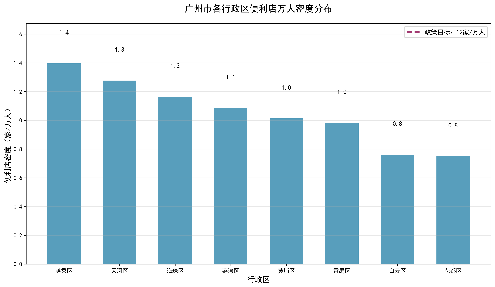
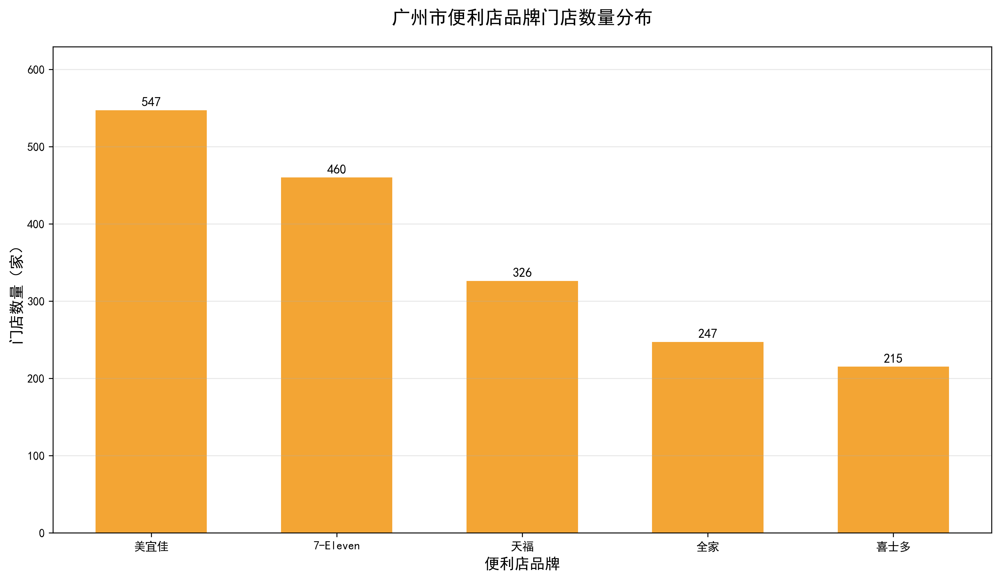
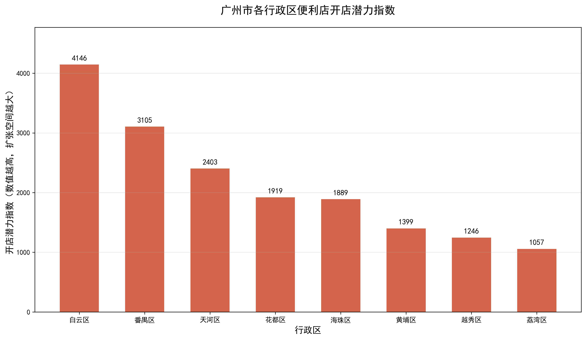
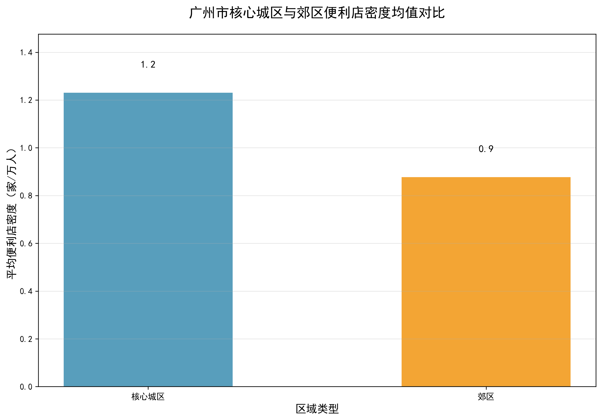

<!-- _class: cover -->
<!-- _paginate: false -->

# 广州市便利店选址潜力分析
## 基于POI数据的空间格局实证研究

###
 小组成员分工

| 姓名 | 学号 | 具体分工 |
| :--- | :--- | :--- |
| 李颖新 | 25210164 | 项目统筹、数据爬取、代码整合 |
| 许芷婷 | 25210273 | 数据清洗、指标计算、结果分析 |
| 刘昊辰 | 24210152 | 可视化绘图、图表解读、结果验证 |
| 张迈 | 25210284 | 背景研究、政策整理、结论撰写 |
| 叶梓晴 | 25210298 | 幻灯片制作、内容排版、材料整理 |
| 刘子薇 | 25210197 | 文件整理、代码调试、格式检查 |

Team02-G08 ｜ 数据分析与经济决策

---

# 目录
1. 研究背景与问题提出
2. 数据来源与研究方法
3. 数据清洗与描述性统计
4. 核心可视化结果分析
5. 研究结论与决策建议
6. 研究局限与未来展望

---

# 一、研究背景与问题提出
## 政策依据
《广州市商业网点布局规划（2020—2035年）》核心目标：
> **中心城区每万人便利店数量达到 12 家，构建一刻钟便民生活圈。**

## 现实问题
1.  区域网点分布不均衡，核心区与郊区密度差距明显
2.  郊区覆盖率偏低，便民服务供给存在缺口
3.  传统选址依赖经验，缺乏量化数据支撑

## 研究目标
基于空间POI数据，量化区域市场饱和度与扩张潜力，为商业选址提供科学实证依据。

---

# 二、数据来源与研究方法
## 数据来源
| 数据类型 | 来源渠道 | 时间维度 | 样本量 |
| :--- | :--- | :--- | :--- |
| 便利店POI数据 | 高德地图开放API | 2026年 | 1826条原始数据 |
| 常住人口数据 | 广州市统计局2025年公报 | 2025年 | 8个行政区 |

<b>有效样本</b>：经清洗后获得1795条有效门店数据，覆盖广州8个核心行政区、5个主流连锁品牌。

## 核心测算指标
1.  **万人门店密度** = 行政区门店总数 / 行政区常住人口（万人）
2.  **开店潜力指数** = (12 - 万人密度) × 行政区常住人口（万人）
    - 指数越高 → 扩张空间越大；指数越低 → 市场越饱和

---

# 三、数据清洗与描述性统计
## 数据清洗流程
1.  **去重**：基于「名称+地址+经纬度」联合去重，删除重复门店
2.  **缺失值处理**：删除核心字段（名称/地址/品牌/行政区）缺失行
3.  **格式标准化**：统一行政区/品牌名称，过滤广州域外异常经纬度
4.  **异常值过滤**：保留经纬度在112.5°E-114.5°E、22.5°N-23.5°N范围内的数据

## 描述性统计结果
| 指标 | 数值 |
|------|------|
| 原始数据行数 | 1826 |
| 去重后行数 | 1805 |
| 最终有效行数 | 1795 |
| 覆盖行政区数 | 8个 |
| 覆盖品牌数 | 5个 |
| 平均每区门店数 | 224.4家 |

---

# 四、核心可视化结果分析
## 1. 区域密度分布

  

    
  

  

    <strong>核心发现</strong> 
    1. 越秀、天河密度最高（1.4/1.3家/万人），布局最密集 
    2. 海珠、荔湾中等（1.2/1.1家/万人），覆盖较均衡 
    3. 白云、花都最低（0.8家/万人），扩张潜力最大 
    4. 所有区域均远低于12家/万人政策目标
  

---

# 四、核心可视化结果分析
## 2. 品牌竞争格局

  

    
  

  

    <strong>核心发现</strong> 
    1. 美宜佳（547家）、7-Eleven（460家）为头部品牌 
    2. 头部品牌合计占比56.5%，市场集中度高 
    3. 本土品牌（美宜佳）规模领先外资品牌
  

---

# 四、核心可视化结果分析
## 3. 开店潜力指数

  

    
  

  

    <strong>核心发现</strong> 
    1. 白云（4146）、番禺（3105）潜力指数最高 
    2. 天河、花都、海珠为中等潜力区域 
    3. 黄埔、越秀、荔湾潜力最低，需谨慎布局
  

---

# 四、核心可视化结果分析
## 4. 城郊密度对比

  

    
  

  

    <strong>核心发现</strong> 
    1. 核心城区平均密度1.2家/万人，郊区0.9家/万人 
    2. 核心城区密度领先郊区33.3% 
    3. 两类区域均远低于政策目标，扩张空间充足
  

---

# 五、研究结论与决策建议
## 核心结论
1.  **空间分布不均衡**：越秀、天河密度最高，白云、花都最低，城郊差距33.3%
2.  **品牌集中度高**：美宜佳、7-Eleven合计占比56.5%，头部效应显著
3.  **扩张优先级**：白云＞番禺＞花都＞天河＞海珠＞黄埔＞越秀＞荔湾
4.  **政策对标**：全市密度远低于12家/万人目标，整体扩张空间充足

## 实操决策建议
### 企业端
1.  优先布局白云、番禺：以社区店为主，覆盖下沉市场
2.  核心城区策略：优化门店结构，提升服务质量，避免同质化
3.  品牌差异化：本土品牌走「规模+性价比」，外资品牌走「精品+体验」

### 政策端
1.  引导资源向郊区倾斜，补齐便民服务短板
2.  规范核心城区门店布局，避免过度竞争

---

# 六、研究局限与未来展望
## 研究局限
1.  数据维度：未纳入租金、客流、消费水平等微观经营数据
2.  空间精度：仅到行政区级别，未细化至街道/社区网格
3.  时间维度：仅为截面数据，缺乏长期趋势分析
4.  样本局限：未覆盖从化、增城等远郊区县

## 未来研究方向
1.  构建精细化选址模型：融合多源数据，提升选址精准度
2.  动态趋势分析：结合历年数据，预测市场演化规律
3.  空间聚类分析：识别高价值热点网格，精准布局

---

<!-- _class: end -->
<!-- _paginate: false -->

# 谢谢聆听
## 欢迎各位老师、同学批评指正

### 附录
- 数据来源：高德地图API、广州市统计局2025年公报
- 项目 GitHub 仓库：https://github.com/GF7799/ex_Team02_G08
- 图表文件：output/fig1_density.png、output/fig2_brand.png、output/fig3_potential.png、output/fig4_core_vs_suburb.png