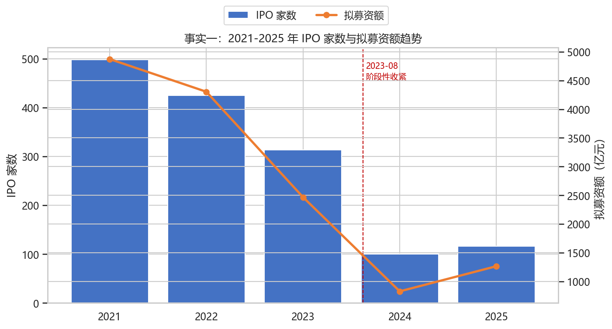
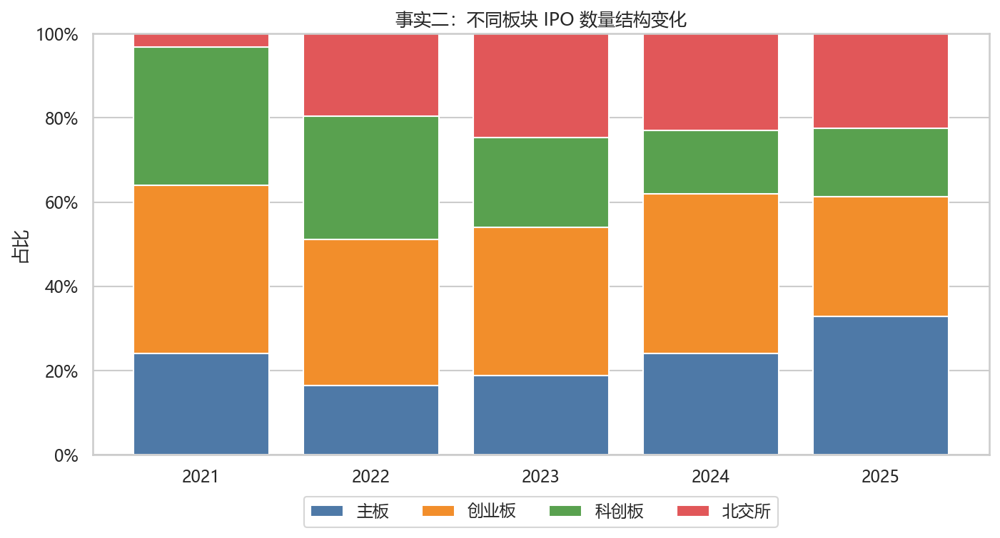
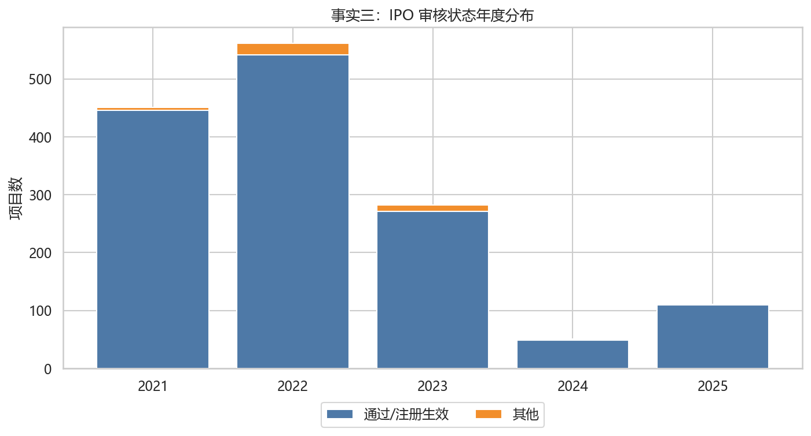
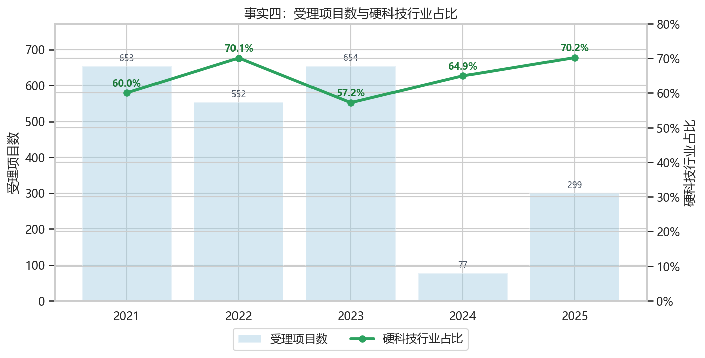
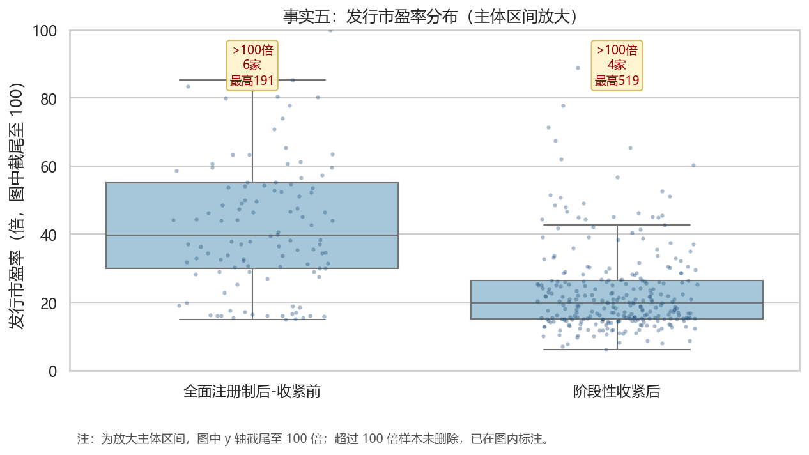

# PB 班 Team02-G06：全面注册制改革对 A 股 IPO 格局与质量的影响分析

## 一、决策主体与研究目标

本报告面向**中国证监会发行监管部门**。发行监管部门面对的不是抽象的“注册制好不好”，而是更具体的日常判断：IPO 节奏是否需要平衡，审核资源应投向哪些板块和行业，在审项目是否出现集中撤回或终止，以及新上市企业的定价风险是否需要重点跟踪。

因此，本报告将研究问题收窄为：**全面注册制实施及 2023 年 8 月阶段性收紧 IPO 节奏后，A 股 IPO 的发行节奏、板块结构、审核状态和可观察质量代理指标是否出现变化？** 这份分析的价值在于形成一套可复用的监测框架，而不是用描述统计直接证明改革的因果效果。

## 二、政策背景

2023 年 2 月 17 日，证监会发布全面实行股票发行注册制相关制度规则，标志着注册制安排从试点板块扩展至全市场。其监管目标可概括为：把选择权交给市场、强化信息披露责任、压实中介机构责任，并提升资本市场服务实体经济和科技创新的能力。

2023 年 8 月，证监会围绕一二级市场平衡作出监管安排，提出根据近期市场情况阶段性收紧 IPO 节奏。这意味着注册制并不等同于无限扩容，发行监管仍需在融资效率、市场承受能力和上市公司质量之间动态权衡。

政策与资料来源：

- [中国证监会：全面实行股票发行注册制制度规则发布实施](https://www.csrc.gov.cn/csrc/c100028/c7123213/content.shtml)
- [中国政府网：全面实行股票发行注册制制度规则发布实施](https://www.gov.cn/xinwen/2023-02/17/content_5741947.htm)
- [中国证监会：统筹一二级市场平衡 优化 IPO、再融资监管安排](https://www.csrc.gov.cn/csrc/c100028/c7421524/content.shtml)

## 三、数据来源与处理

本报告优先使用 AkShare 公开接口，主要包括：

- `stock_ipo_review_em`：获取 IPO 审核状态、上会日期、上市日期、拟融资额和上市板块。
- `stock_register_all_em`：获取注册制项目的受理日期、拟上市地点和行业信息。
- `stock_new_ipo_cninfo`：获取新股发行价、发行数量、发行市盈率等定价相关信息。

处理方法包括：统一日期字段，按上市日期或受理日期识别年份；将上市板块归并为主板、创业板、科创板、北交所；将电子、计算机、医药生物、机械设备、电力设备、通信、半导体等相关行业识别为“硬科技”行业；将 2023 年 2 月 17 日和 2023 年 8 月 27 日作为政策分段节点。

## 四、统计事实

### 事实一：IPO 家数与拟募资额趋势

样本中 2021-2025 年上市 IPO 共 1452 家。2023 年后年度 IPO 家数和拟募资额整体走低，2024-2025 年更能体现阶段性收紧后的发行节奏变化。 对发行监管部门而言，这张图直接回答“发行节奏是否明显收紧”，也提示后续需要结合市场成交、估值和在审项目储备观察节奏是否合意。

### 事实二：板块结构变化

2025 年样本 IPO 板块结构为：主板 32.8%、创业板 28.4%、科创板 16.4%、北交所 22.4%。板块结构变化可用于观察注册制是否更多承接成长型与科技型企业。 如果创业板、科创板或北交所占比变化较大，说明注册制改革对不同融资场景的承接能力有所不同，监管部门可以据此进一步检查审核标准、行业定位和市场容量是否匹配。

### 事实三：审核状态年度分布

审核状态口径显示通过/注册生效和其他状态均可被持续监测；若接口字段更新，应在 Notebook 中保留原始状态并重新归类。 撤回和终止项目的变化尤其值得关注：它们既可能反映监管问询和中介责任压实，也可能反映市场窗口变化导致企业主动调整上市计划。

### 事实四：硬科技行业占比

受理项目中硬科技行业占比从 2021 年的 60.0% 变为 2025 年的 70.2%，可作为注册制服务科技创新导向的结构性指标。 这一指标服务于“资本市场是否更好支持科技创新”的监管目标，但它只是结构性证据，不能单独代表企业质量或创新能力。

### 事实五：发行市盈率作为质量代理指标

从发行市盈率分布看，全面注册制后-收紧前均值 46.7 倍、中位数 39.8 倍；阶段性收紧后均值 27.4 倍、中位数 19.9 倍。图表为看清主体分布将 y 轴截尾至 100 倍，但未删除极值；全面注册制后-收紧前超过 100 倍 6 家、最高 190.6 倍；阶段性收紧后超过 100 倍 4 家、最高 519.1 倍。 该指标应与行业属性和市场环境一并解释。 市盈率本身不是质量，但过高的发行估值会影响上市后表现和投资者保护，因此适合作为质量监测框架中的风险代理变量。

## 五、初步结论

第一，全面注册制后的 IPO 观察不能只看上市家数，还应同时看拟募资额、板块结构和在审项目状态。发行端数量下降并不必然意味着融资功能弱化，也可能是监管节奏主动平衡的结果。

第二，板块结构和硬科技占比可以帮助判断注册制是否更好服务科技创新与实体经济。相比单纯统计 IPO 家数，结构指标更贴近监管目标。

第三，审核状态中的撤回和终止值得作为常规监测项。若某一年撤回或终止集中上升，监管部门需要进一步区分原因：是申报质量不足、企业主动调整，还是市场环境变化。

第四，发行市盈率等质量代理指标应谨慎解释。它可以提示定价风险，但不能替代对企业盈利能力、研发投入、信息披露质量和上市后表现的综合评估。

## 六、局限性说明

- AkShare 接口依赖公开网页数据源，字段名称和可用性可能随数据源变化而变化。
- `拟融资额` 不完全等同于实际募资额，适合作为发行融资规模的近似观察。
- 硬科技行业识别采用关键词法，可能存在行业归类误差。
- 本报告仅做描述统计，不进行回归、事件研究或因果识别，因此结论应表述为“可观察变化”而非“改革导致”。
- 质量代理指标有限，发行市盈率只能反映定价风险的一部分。
